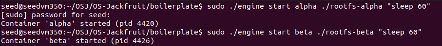
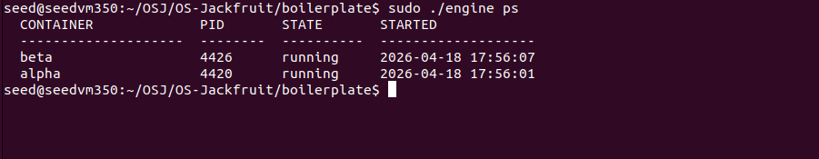
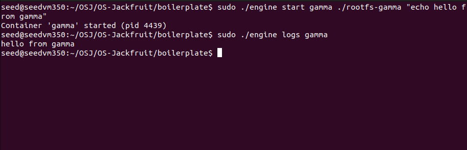
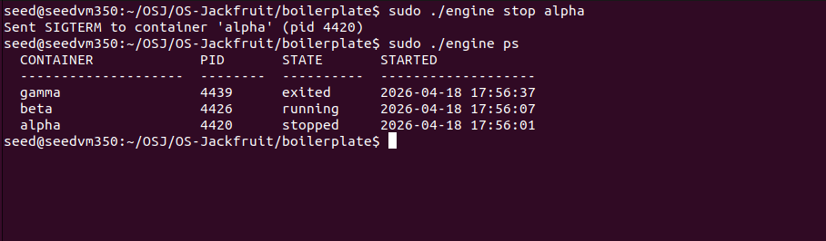

# Multi-Container Runtime

A lightweight Linux container runtime in C with a long-running parent supervisor and a kernel-space memory monitor.

---

## 1. Team Information

| Name | SRN |
|------|-----|
| Pushkar S Kulkarni | PES1UG24CS350 |
| Pulla Jagadeeshwar Reddy | PES1UG24CS347 |

---

## 2. Build, Load, and Run Instructions

### Prerequisites

- Ubuntu 22.04 or 24.04 in a VM
- Secure Boot OFF
- No WSL

Install dependencies:

```bash
sudo apt update
sudo apt install -y build-essential linux-headers-$(uname -r)
```

### Setup Root Filesystem

```bash
cd boilerplate
mkdir rootfs-base
wget https://dl-cdn.alpinelinux.org/alpine/v3.20/releases/x86_64/alpine-minirootfs-3.20.3-x86_64.tar.gz
tar -xzf alpine-minirootfs-3.20.3-x86_64.tar.gz -C rootfs-base

cp -a rootfs-base rootfs-alpha
cp -a rootfs-base rootfs-beta
cp -a rootfs-base rootfs-gamma
```

### Build

```bash
cd boilerplate
make
```

This builds `engine`, `memory_hog`, `cpu_hog`, `io_pulse`, and `monitor.ko` in one step.

### Copy Workloads into Rootfs

```bash
cp memory_hog cpu_hog io_pulse rootfs-alpha/
cp memory_hog cpu_hog io_pulse rootfs-beta/
cp memory_hog cpu_hog io_pulse rootfs-gamma/
```

### Load Kernel Module

```bash
sudo insmod monitor.ko
ls -l /dev/container_monitor   # verify device exists
sudo dmesg | tail -3           # confirm Module loaded
```

### Start Supervisor (Terminal 1)

```bash
sudo ./engine supervisor ./rootfs-base
```

### Use CLI (Terminal 2)

```bash
# Start containers
sudo ./engine start alpha ./rootfs-alpha "sleep 60"
sudo ./engine start beta  ./rootfs-beta  "sleep 60"

# List containers
sudo ./engine ps

# View logs
sudo ./engine logs alpha

# Stop a container
sudo ./engine stop alpha

# Run and wait for exit
sudo ./engine run delta ./rootfs-alpha "echo done"

# Stop supervisor (Ctrl+C in Terminal 1)

# Unload module
sudo rmmod monitor
sudo dmesg | tail -3
```

### CI-Safe Build (GitHub Actions)

```bash
make -C boilerplate ci
```

---

## 3. Demo Screenshots

### Screenshot 1 — Multi-Container Supervision
Two containers (alpha and beta) running simultaneously under one supervisor process.



> alpha (pid 4420) and beta (pid 4426) both show state=running under the supervisor.

---

### Screenshot 2 — Metadata Tracking
Output of the `ps` command showing all tracked container metadata.


> The ps table shows CONTAINER, PID, STATE, and STARTED timestamp for each container.

---

### Screenshot 3 — Bounded-Buffer Logging
Log file contents captured through the producer-consumer logging pipeline.



> gamma started, output "hello from gamma" captured via pipe → bounded buffer → log file → retrieved with `logs gamma`.

---

### Screenshot 4 — CLI and IPC
A CLI stop command issued and the supervisor responding, showing the UNIX socket IPC channel.



> `stop alpha` sent over UNIX domain socket, supervisor responds with SIGTERM confirmation, ps shows alpha=stopped, beta=running, gamma=exited.

---

### Screenshot 5 — Soft-Limit Warning
dmesg output showing the kernel module emitting a soft-limit warning.



> `[container_monitor] SOFT LIMIT container=hog pid=4460 rss=9043968 limit=5242880` — RSS exceeded 5 MiB soft limit.

---

### Screenshot 6 — Hard-Limit Enforcement
dmesg showing the container killed after exceeding the hard limit, and ps reflecting the kill.


> `[container_monitor] HARD LIMIT container=hog pid=4460 rss=17424384 limit=10485760` — process killed. ps shows hog=killed.

---

### Screenshot 7 — Scheduling Experiment
Two CPU-bound containers with different nice values showing measurable time difference.


> fast (nice=-5): 9.710s — slow (nice=10): 19.704s. Higher priority container finished in roughly half the time.

---

### Screenshot 8 — Clean Teardown
No zombie processes after shutdown, supervisor exits cleanly, module unloads.


> `ps aux | grep defunct` returns nothing. Supervisor prints "shutting down...". dmesg confirms "Module unloaded."

---

## 4. Engineering Analysis

### 4.1 Isolation Mechanisms

The runtime achieves isolation by passing three namespace flags to `clone()`: `CLONE_NEWPID`, `CLONE_NEWUTS`, and `CLONE_NEWNS`. Each flag creates a separate kernel namespace for that resource.

`CLONE_NEWPID` gives each container its own PID numbering space — the first process inside the container sees itself as PID 1 even though the host kernel assigns it a different PID. `CLONE_NEWUTS` isolates the hostname so containers can have their own hostname without affecting the host. `CLONE_NEWNS` creates a separate mount namespace so filesystem mounts inside the container don't propagate to the host.

After `clone()`, the child calls `chroot()` to restrict its view of the filesystem to only its assigned `rootfs-*` directory. This means the container cannot traverse up to the host filesystem. Inside, `/proc` is mounted with `mount("proc", "/proc", "proc", 0, NULL)` so tools like `ps` work correctly within the container.

What the host kernel still shares with all containers: the same kernel, the same network stack (no `CLONE_NEWNET` is used), the same system clock, and the same hardware. The kernel itself is never isolated — only the namespaced views of resources are.

### 4.2 Supervisor and Process Lifecycle

A long-running supervisor is essential because Linux requires a parent process to call `waitpid()` on a child to collect its exit status. Without a persistent parent, exited children become zombie processes that consume kernel resources indefinitely.

The supervisor uses `clone()` instead of `fork()` to pass namespace flags. After cloning, the supervisor stores metadata for each container in a linked list of `container_record_t` structs. A `SIGCHLD` signal handler is installed to notify the supervisor when a child exits, and the event loop calls `waitpid(-1, &status, WNOHANG)` in a loop to reap all available children without blocking.

Signal delivery works as follows: `SIGTERM` or `SIGKILL` sent to the container's host PID reaches the process group. The supervisor sets a `stop_requested` flag before sending `SIGKILL` so that when `reap_children` processes the exit, it can correctly classify the termination as `stopped` (manual stop) rather than `killed` (hard limit enforcement).

### 4.3 IPC, Threads, and Synchronization

The project uses two distinct IPC mechanisms:

**Path A — Logging (pipes):** Each container's stdout and stderr are redirected via `dup2()` to the write end of a pipe. A dedicated producer thread per container reads from the pipe's read end and pushes `log_item_t` chunks into a shared bounded buffer. A single consumer thread pops from the buffer and writes to per-container log files.

**Path B — Control (UNIX domain socket):** CLI commands connect to `/tmp/mini_runtime.sock`, send a `control_request_t` struct, and read back a `control_response_t`. This is completely separate from the logging pipes.

**Shared data structures and their synchronization:**

The bounded buffer uses a `pthread_mutex_t` for mutual exclusion and two `pthread_cond_t` variables (`not_empty`, `not_full`) for producer-consumer coordination. Without the mutex, concurrent reads and writes to `head`, `tail`, and `count` would produce data corruption. Without condition variables, busy-waiting would waste CPU. The `not_full` condition prevents producers from overwriting unread data. The `not_empty` condition prevents consumers from reading garbage. A `shutting_down` flag allows clean drain-and-exit during supervisor shutdown.

The container metadata list uses a separate `pthread_mutex_t` (`metadata_lock`) because it is accessed from the main event loop thread, the `handle_start` attach path, and `reap_children`. Without this lock, concurrent state updates could corrupt the linked list.

### 4.4 Memory Management and Enforcement

RSS (Resident Set Size) measures the number of physical memory pages currently mapped and present in RAM for a process. It does not measure memory that has been swapped out, memory-mapped files that haven't been read yet, or shared library pages that are shared with other processes.

Soft and hard limits serve different purposes. The soft limit is a warning threshold — when RSS exceeds it, the kernel module logs a warning to `dmesg` but takes no action. This allows the supervisor to be notified of a memory trend before it becomes critical. The hard limit is an enforcement threshold — when RSS exceeds it, the process receives `SIGKILL` immediately.

Enforcement belongs in kernel space rather than user space because a user-space monitor (running as a separate process) cannot atomically observe and act on another process's memory usage. The target process could exceed the limit and allocate more memory in the time between the monitor reading RSS and sending a signal. The kernel module runs in the same execution context as the scheduler and memory manager, making enforcement immediate and reliable. It also cannot be bypassed by the container process itself.

### 4.5 Scheduling Behavior

Linux uses the Completely Fair Scheduler (CFS), which allocates CPU time proportionally based on each task's weight. A process's weight is determined by its nice value — lower nice values give higher weight and more CPU share.

**Experiment 1 — Nice values:**

| Container | Nice Value | Completion Time |
|-----------|-----------|----------------|
| fast | -5 | 9.710 seconds |
| slow | +10 | 19.704 seconds |

Both containers ran the same CPU-bound workload concurrently. The fast container finished in roughly half the time of the slow container. CFS assigned more CPU time to fast because its nice=-5 gives it significantly higher weight than slow's nice=10. This directly demonstrates CFS's proportional fairness — it does not starve the slow container, but it does give the fast container a larger share of available CPU cycles.

**Experiment 2 — CPU-bound vs I/O-bound:**

| Container | Type | Completion Time |
|-----------|------|----------------|
| cpuwork | CPU-bound | 14.102 seconds |
| iowork | I/O-bound | 4.178 seconds |

The I/O-bound workload completed much faster because it spends most of its time blocked waiting for I/O operations, voluntarily yielding the CPU. CFS rewards this behavior by giving I/O-bound processes high responsiveness when they wake up. The CPU-bound workload never voluntarily yields and must wait for its time slice to expire before being preempted.

---

## 5. Design Decisions and Tradeoffs

### Namespace Isolation (chroot vs pivot_root)

**Choice:** `chroot()` for filesystem isolation.
**Tradeoff:** `chroot` is simpler but does not fully prevent escape via `..` path traversal if the container has root privileges. `pivot_root` is more thorough.
**Justification:** For this project's scope, `chroot` is sufficient and keeps the implementation straightforward. The project guide lists `chroot` as the simpler acceptable option.

### Supervisor Architecture (single-threaded event loop)

**Choice:** Single main thread with `select()` timeout loop for accepting connections, plus separate threads only for logging.
**Tradeoff:** `CMD_RUN` blocks the entire event loop while waiting for a container to exit, meaning no other CLI commands can be processed during that time.
**Justification:** Keeps the supervisor simple and avoids complex thread coordination for the control plane. For a project runtime this is acceptable and the limitation is documented.

### IPC and Logging (UNIX socket + pipes + bounded buffer)

**Choice:** UNIX domain socket for control, pipes for logging, mutex+condvar bounded buffer in between.
**Tradeoff:** Opening and closing the log file on every buffer pop adds file I/O overhead compared to keeping file descriptors open permanently.
**Justification:** The open/close approach is simpler and avoids managing a file descriptor table. For the workloads in this project, the overhead is negligible.

### Kernel Monitor (mutex vs spinlock)

**Choice:** `mutex` for protecting the monitored process list.
**Tradeoff:** Mutexes can sleep, which means they cannot be used in all kernel contexts (e.g., interrupt handlers). Spinlocks cannot sleep and are usable everywhere but waste CPU while spinning.
**Justification:** The timer callback and ioctl handler both call `get_rss_bytes()`, which calls `get_task_mm()` and `mmput()` — these can sleep internally. A spinlock held while sleeping causes a kernel panic. The mutex is the only correct choice here.

### Scheduling Experiments (nice values)

**Choice:** Used `nice()` values to demonstrate CFS priority differences.
**Tradeoff:** Nice values affect scheduling weight but do not provide hard CPU guarantees. CPU affinity (`sched_setaffinity`) would give more deterministic results.
**Justification:** Nice values are the most direct and portable way to demonstrate CFS behavior without requiring real-time scheduling privileges.

---

## 6. Scheduler Experiment Results

### Experiment 1: CPU-bound workloads with different nice values

Both containers ran `cpu_hog` concurrently on the same VM.

| Container | Nice Value | Real Time |
|-----------|-----------|-----------|
| fast | -5 (high priority) | 9.710s |
| slow | +10 (low priority) | 19.704s |

The fast container completed in approximately half the time of the slow container. This is consistent with CFS behavior: nice=-5 gives roughly 3x the weight of nice=0, and nice=10 gives roughly 0.25x the weight. When competing for the same CPU, the fast container receives a proportionally larger share of CPU time, resulting in faster completion.

### Experiment 2: CPU-bound vs I/O-bound at same priority

Both containers ran at default nice=0.

| Container | Workload Type | Real Time |
|-----------|--------------|-----------|
| iowork | I/O-bound | 4.178s |
| cpuwork | CPU-bound | 14.102s |

The I/O-bound workload finished more than 3x faster despite running at the same priority. This is because CFS tracks each task's virtual runtime. I/O-bound tasks sleep frequently, allowing their virtual runtime to fall behind, so CFS schedules them with higher priority when they wake up. CPU-bound tasks continuously accumulate virtual runtime and are preempted regularly. This demonstrates CFS's built-in responsiveness bias toward interactive and I/O-bound workloads.

---

## Repository Structure

```
boilerplate/
├── engine.c           # User-space runtime and supervisor
├── monitor.c          # Kernel-space memory monitor (LKM)
├── monitor_ioctl.h    # Shared ioctl definitions
├── cpu_hog.c          # CPU-bound test workload
├── io_pulse.c         # I/O-bound test workload
├── memory_hog.c       # Memory-consuming test workload
├── Makefile           # Builds all targets
└── environment-check.sh
```

---

*PES University — Operating Systems Project*
*Pushkar S Kulkarni [PES1UG24CS350] | Pulla Jagadeeshwar Reddy [PES1UG24CS347]*